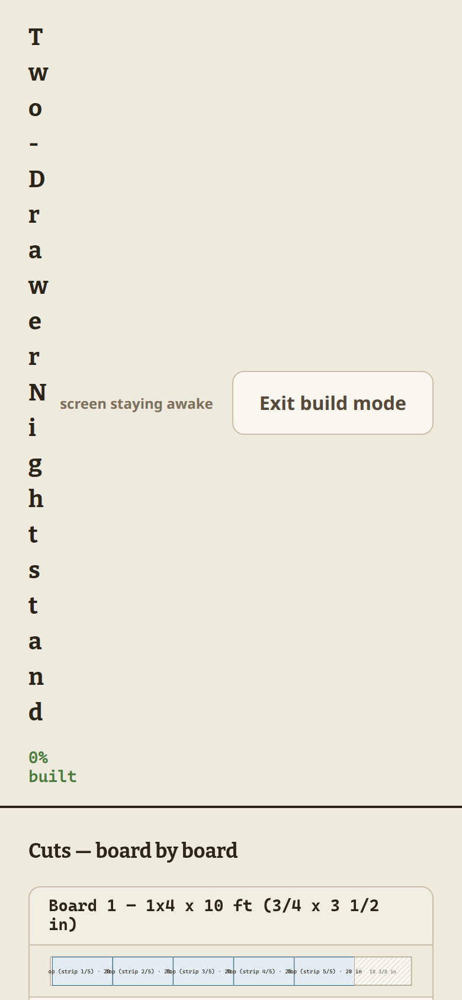

# DIY front-end audit — Blueprint Buddy

**Date:** 2026-07-15  
**Method:** Live click-through of every surface a hobby woodworker touches — welcome → starters → chat refinements → every plans tab → viewport tools → More/Export menus → build mode → share/import — at **1440×900**, **1024×768**, and **390×844**. Script: `test/diy-audit.playwright.js`. Evidence: `docs/ui/diy-audit-evidence/`. Findings log: `docs/ui/diy-audit-evidence/findings.json`.

**Audience lens:** garage-shop DIY — Saturday afternoons, miter saw, wants *their* piece with a shopping list and a build path. Not CAD power users. Not engineers reading Wood Handbook tables for fun.

---

## Verdict

The product’s **core pipeline is excellent** and already unique: sentence (or starter) → structurally-checked plans → board packing → shop companion. Desktop DIY flows mostly work. **Phone — especially Build mode — is where trust breaks.** One layout bug alone turns the shop companion into an unusable vertical title stack; cutting diagrams render at ~5–6 px of readable text. That is the product’s promised moment of truth, and it currently fails for the person standing at the saw.

Secondary gap: the UI still speaks like an engineering studio (six plan tabs, editable price grid, revision compare, SketchUp-first export help) while the brand/token system designed for DIY (“Showroom”) has not landed in `src/styles.css`.

| Live pass summary | Count |
| --- | --- |
| Surfaces that worked as expected | 62 |
| Observations / nuance | 4 |
| P2 issues | 3 (1 false positive on clarify — see below) |
| P1 issues | 8 |
| P0 issues | 1 (build-mode title + diagram readability on phone) |

---

## What’s good (keep, protect)

These are load-bearing DIY wins. Do not dilute them chasing polish elsewhere.

| # | Item | Why it matters to DIY | Evidence |
| --- | --- | --- | --- |
| G1 | Non-blocking welcome + 3 entry paths | First visit is inviting; bench stays live | desk-01-welcome |
| G2 | Starter gallery with real 3D thumbs | Instant plans without writing a prompt | desk-02-gallery |
| G3 | One-shot hero assemble | The piece feels real, not CAD | desk-03-nightstand |
| G4 | Chat → code-owned diff chips | “lower 2 in” shows `24 → 22` computed in code | desk-05-chat-height |
| G5 | Clarifying chips for ambiguous asks | “make it bigger” → Wider / Deeper / Taller | desk-18-joint (chat) |
| G6 | Cut list + provenance taps | Trust in numbers without leaving the app | desk-14-provenance |
| G7 | Stock shopping list + packing diagrams | The lumber-yard moment | desk-13-tab-stock |
| G8 | Materials BOM + species compare | Cost and wood choice without spreadsheet | desk-17-species |
| G9 | Assembly playback + joint inspector | Learn the joint on *this* piece | desk-18-joint, desk-19-playback |
| G10 | Integrity stamps + one-click fixes | Safety without a structural engineering degree | desk-20-integrity |
| G11 | Blueprint mode + F/S/T/Iso | Technical drawing when you need it | desk-08-blueprint |
| G12 | Build mode (desktop/tablet) | Board-by-board checklist + wake lock | desk-35-build, tablet-02-build |
| G13 | Share codes (BB4:) round-trip | Shop-to-phone / friend handoff without accounts | desk-32-share, desk-37-import |
| G14 | Export suite (CSV, SVG, GLB, print) | Leaves the app when the shop needs files | desk-33-export |
| G15 | Units / dual / theme / flat render | Shop preference + low-power devices | desk-26–28 |
| G16 | Autosave + projects | Returning Saturday is frictionless | desk-31-projects |
| G17 | Founding rule held in UI | Model never writes dimensions into state | architecture + chat chips |

---

## What’s really needed (gaps that block DIY success)

Ordered by how often a weekend maker hits them.

### N1 — Phone Build mode must be readable at the saw — **P0**
**What:** On 390×844, `#bmName` collapses to **16×600 px** (`overflow-wrap: anywhere` + flex shrink). The header eats ~682 px of vertical space; board SVG labels paint at **~5–6 px tall** (SVG `font-size="11"` scaled into a 27 px-tall strip).

**DIY impact:** Build mode is the shop companion. Unreadable cuts = the feature does not exist on the device people actually carry into the garage.

**Fix direction:** Stop flex-shrinking `.bm-name` (`flex: 1 1 auto; min-width: min(100%, 12ch); overflow-wrap: break-word` or move progress/exit to a second row *without* allowing width→0). Raise diagram min-height; pan/zoom lightbox (already on `docs/ui/phase2-roadmap.md` item 2).



### N2 — Phone header must keep identity + undo/redo — **P1**
**What:** `.brand-name` `display:none` under 880 px; design name ~61 px (“Two…”); redo hidden; Export + More sit side-by-side (~159 px).

**DIY impact:** Can’t tell whose app this is; can’t redo a mis-tap with dusty fingers; project name is the only context and it’s truncated to noise.

**Fix direction:** phase2-roadmap item 1 — fold Export into More under 560 px; restore redo; 96 px floor on design name; keep a compact brand mark + short wordmark.

### N3 — Readiness path on phone — **P1**
**What:** `#readiness` is `display:none` under 660 px. Phones get no Design → Validate → Plans → Build affordance.

**DIY impact:** The product’s story (“intent → drafted → proven → built”) disappears on the primary handheld surface.

**Fix direction:** phase2-roadmap item 4 — 4-dot pill in the chat sheet header or beside the tab bar.

### N4 — Stock / build cutting diagrams on phone — **P1** (pairs with N1)
**What:** Stock-tab SVG height ~29 px; same board diagrams feed Build mode.

**DIY impact:** Can’t verify “cut here” at the miter saw stand.

### N5 — Offline / no-key chat honesty — **P1**
**What:** Without `ANTHROPIC_API_KEY`, “make the top oak instead of walnut” replies “Adjusted Black Walnut / no dimensional change”. Phone also logs CORS errors hitting `api.anthropic.com` directly.

**DIY impact:** Beginners think the app is broken or ignored them. Offline mode is a feature; silent wrong-acks are not.

**Fix direction:** Detect offline parser path; say “Working offline — try: ‘switch species to oak’” with a tappable chip. Never attempt bare Anthropic from the browser when the proxy is absent (or swallow CORS and use the offline parser only).

### N6 — Shop-first export help — **P1**
**What:** Export → help opens “Getting your design into SketchUp” first. DIY primary exits are **Print**, **CSV cut list**, **SVG drawing**, **Build mode**, **Share code**.

**DIY impact:** Reinforces “this is a CAD tool” instead of “this is a shop plan”.

**Fix direction:** Reorder help: Print / phone Build / CSV / share → then CAD/AR as advanced.

### N7 — First-build guided path — **P1** (product gap)
**What:** DESIGN.md Tier 4; not built. Welcome dumps a full studio on day one.

**DIY impact:** Beginners don’t know whether to stare at Integrity, Stock, or chat.

**Fix direction:** One “Build your first nightstand” tour: pick starter → glance integrity → open Build mode. Hide Shop reference / Compare / price editor until second session.

### N8 — PWA installability for the bench — **P1**
**What:** phase2-roadmap item 14 — no manifest / theme-color / icon.

**DIY impact:** Losing the tab mid-glue-up with sawdust on your hands is a real failure mode.

---

## What isn’t needed (or is overkill for DIY primary)

These can stay for power users, but should not compete for first-run attention or header space.

| # | Item | Verdict | Recommendation |
| --- | --- | --- | --- |
| X1 | Revision compare (ghost overlay) | Overkill for DIY v1 | Keep in History; don’t promote |
| X2 | Logo-hold diagnostics | Engineer tool | Keep hidden; fine |
| X3 | Full editable price grid (every HW SKU) | Accurate but intimidating | Collapse further; default “ballpark total” with “Edit prices” deep |
| X4 | SketchUp `.rb` / Claude connector help as headline | Niche | Demote under Advanced export |
| X5 | 1/32 in precision default affordance | Rarely needed at hobby scale | Default 1/8; expose 1/16–1/32 in More |
| X6 | Dual-units everywhere as a first control | Useful sometimes | Keep in More (already) |
| X7 | Shop reference as a peer to Cut list | Encyclopedia, not a plan | Move behind “Learn” or contextual links from advisories |
| X8 | Interaction-system Tier 2+ (particles, shaders, scroll choreography) | Delight, not shop truth | Defer until phone Build mode is fixed |
| X9 | Semantic zero-div shell rewrite | A11y target, large rewrite | Adopt incrementally; don’t block DIY fixes |
| X10 | Species chat phrasing that needs LLM | Offline parser limits | Prefer chips over free-text for material swaps when offline |

---

## What exists but could be better (and how)

| # | Item | Priority | Problem | How to improve |
| --- | --- | --- | --- | --- |
| B1 | Brand / Showroom tokens | P1 | Live UI is oat + machinist blue; `docs/ui/brand-system.md` (seafoam/fern/mustard/rust/walnut) not in `src/styles.css` | Adopt tokens via `var()` swap; keep Blueprint Mode cyanotype as the deliberate blue exception |
| B2 | Welcome card emoji | P2 | Gallery left emoji; welcome still 💬📐🗂 | Use icon set / mini renders |
| B3 | Reference search | P2 | Search stays on active sub-tab; “dovetail” on Wood → empty state that *suggests* dovetail | Search across tabs or auto-jump to matching section |
| B4 | Viewport toolbar on phone | P2 | Explode track 16 px tall; Dims/Draft 26 px | Min 40 px targets; explode as a bottom-sheet slider |
| B5 | Advisory chips vs sheet (phone) | P2 | Roadmap item 3; muted when no chips, but placement still fights content when advisories fire | Collapse to “⚠ N” pill beside sheet peek |
| B6 | Stock lede copy | P2 | “Deterministic packing… kerf… end trim” reads as engine docs | DIY: “Here’s what to buy. Diagrams show every cut on each board.” |
| B7 | Integrity for beginners | P2 | PASS/ADVISORY with creep and ΔMC is correct but dense | Beginner level: one plain sentence + “See details”; keep full cards for Intermediate+ |
| B8 | Chat collapse / sheet discoverability | P2 | Works; peek copy can be richer (“Ask to change wood, size…”) | One example chip always visible on phone peek |
| B9 | Photo-to-design | P2 | Button present; needs API; failure mode unclear offline | Offline: “Photo needs connection” toast; don’t open empty file picker hope |
| B10 | Splitter touch | P3 | Roadmap item 6 — thin hit area, no double-tap reset | 20 px hit; double-tap reset |
| B11 | Keyboard shortcut map | P3 | `?` is viewport-only | Two-column help (Viewport / Everywhere) |
| B12 | Sticky table headers | P3 | Long cut lists lose headers | Roadmap item 9 |
| B13 | Focus restore after panel re-render | P3 | Roadmap item 10 | Restore to panel heading |
| B14 | Payload / font subset | P3 | 1.5 MB single file | Roadmap item 11 |
| B15 | Hash UI state | P3 | Tabs restore; split/chat don’t | Roadmap item 16 |
| B16 | Doors / hinges / stretchers | P1 product | DESIGN.md Tier 1 — cabinets feel incomplete | Ship when geometry work lands; UI already has hardware READY stratum |
| B17 | Finish preview on 3D | P2 product | Piece always looks raw | Material pool finish classes |
| B18 | Scrap-first / room-fit / QR share | P3 product | DESIGN.md Tier 3 | After shop-phone basics |

---

## Ranked backlog — every item

Priority bands: **P0** ship-blocking for DIY phone, **P1** normal DIY friction, **P2** depth/clarity, **P3** polish / later roadmap. Rank is within the whole list (1 = do first).

| Rank | Pri | ID | Item | Type |
| --- | --- | --- | --- | --- |
| 1 | P0 | N1 | Fix phone Build-mode title flex wrap (16×600 bug) | Bug |
| 2 | P0 | N1b | Phone Build/Stock diagram min-height + tap-to-zoom | UX |
| 3 | P1 | N2 | Phone header: Export→More, restore redo, name floor, brand | UX |
| 4 | P1 | N5 | Honest offline chat + no bare Anthropic CORS | Bug/UX |
| 5 | P1 | N3 | Phone readiness dots | UX |
| 6 | P1 | N4 | Stock-tab diagram readability (shared with N1b) | UX |
| 7 | P1 | N6 | Shop-first export/help ordering | Content |
| 8 | P1 | N8 | PWA manifest + theme-color + icon | Feature |
| 9 | P1 | N7 | First-build guided path | Feature |
| 10 | P1 | B1 | Adopt Showroom brand tokens into `styles.css` | Design |
| 11 | P1 | B16 | Doors/hinges/stretchers (shop truth) | Product |
| 12 | P2 | B3 | Cross-tab reference search | UX |
| 13 | P2 | B4 | Viewport touch targets / explode affordance | UX |
| 14 | P2 | B5 | Advisory chip collapse on phone | UX |
| 15 | P2 | B6 | DIY plain-language ledes (Stock, Integrity beginner) | Content |
| 16 | P2 | B7 | Beginner integrity summary mode | UX |
| 17 | P2 | B2 | Welcome cards without emoji | Design |
| 18 | P2 | B8 | Richer chat peek prompts on phone | UX |
| 19 | P2 | B9 | Photo upload offline failure honesty | UX |
| 20 | P2 | B17 | Finish preview on materials | Product |
| 21 | P2 | X3′ | Soften price editor (keep power, hide by default) | UX |
| 22 | P3 | B10 | Splitter touch hit area + double-tap | UX |
| 23 | P3 | B11 | Global keyboard map in `?` | UX |
| 24 | P3 | B12 | Sticky cut-list headers | UX |
| 25 | P3 | B13 | Focus restore after panel render | a11y |
| 26 | P3 | B14 | Font/Three subsetting | Perf |
| 27 | P3 | B15 | Hash for split/chat state | UX |
| 28 | P3 | X8 | Living Workshop Tier 2+ motion/shaders | Delight |
| 29 | P3 | B18 | Scrap-first / room-fit / QR | Product |
| 30 | P3 | X9 | Semantic shell migration | a11y |

**Explicitly deprioritize for DIY (do not rank into the next sprint):** X1 promote compare, X2 diagnostics UX, X4 SketchUp-first messaging, X8 particles, full semantic rewrite.

---

## Journey scorecard (DIY persona)

| Journey step | Desktop | Phone | Notes |
| --- | --- | --- | --- |
| First open / welcome | Excellent | Good | Brand wordmark missing on phone |
| Pick a starter | Excellent | Good | Gallery works; thumbs load |
| Refine in chat | Excellent* | Good* | *Offline species swap weak; clarify chips work |
| Trust the cut list | Excellent | Fair | Table scrolls; provenance works |
| Buy lumber (Stock) | Excellent | Poor | Diagrams too short |
| Check strength | Excellent | Fair | Dense for beginners |
| Learn a joint | Excellent | Good | Modal works |
| Export / print / share | Excellent | Good | Help is CAD-skewed |
| Build at the bench | Excellent | **Fail** | Title stack + tiny diagrams |
| Come back next Saturday | Excellent | Good | Autosave / projects |

---

## Relationship to existing docs

This audit **confirms** several items already queued in `docs/ui/phase2-roadmap.md` (1–4, 14) and elevates phone Build mode from “diagram polish” to **P0 layout bug**. It also argues for **reordering product attention**: shop-phone reliability and DIY copy before Showroom polish, Living Workshop Tier 2 effects, or semantic-shell purity.

Engineering-truth guardrails (`test/audit.test.js`, golden corpus, handcalc) stay untouched — this audit is UI/product, not physics.

---

## How to re-run

```bash
npm run build
node test/diy-audit.playwright.js
# → dist/audit-shots/, dist/diy-audit-log.json
```

Update evidence under `docs/ui/diy-audit-evidence/` when intentional UI changes land.
